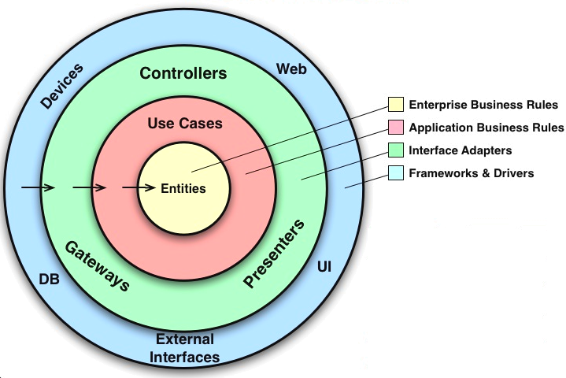

# 📗 Node API With MongoDB Atlas

# 🔍 Explore a Aplicação em Funcionamento

Convidamos você a explorar a aplicação **"Node API With MongoDB Atlas"** em sua versão online: 

# 📑 Sobre o projeto 

Este projeto é uma **API** desenvolvida em **Node.js** com **TypeScript**, seguindo os princípios da **Clean Architecture** e **Clean Code**. O *deploy* foi realizado na **Vercel**, permitindo fácil acesso e escalabilidade.

# 📚 Stack Tecnológica

# 🧱 Arquitetura e Design

O planejamento desta aplicação foi desenvolvido com base no **data-driven design**, que orienta as decisões de *design* a partir das necessidades e interações dos dados, garantindo flexibilidade e escalabilidade. A arquitetura escolhida foi a **Clean Architecture**, que promove a separação clara entre as regras de negócios e os detalhes de implementação, protegendo o sistema de dependências diretas de *frameworks*. Isso permite, por exemplo, substituir o **MongoDB** por outro banco de dados sem impactar as entidades ou casos de uso, mantendo a aplicação independente de tecnologias específicas. Além disso, conceitos da arquitetura hexagonal foram aplicados, utilizando contratos (*ports*) e implementações (*adapters*) para garantir a comunicação entre as camadas do sistema de forma desacoplada, em conformidade com a regra da dependência.

# 🧪 Testes Automatizados e Garantia de Funcionamento

Com a **Clean Architecture**, as regras de negócio podem ser testadas de forma independente da interface do usuário, banco de dados, servidor *web* ou qualquer outro componente externo. Para garantir essa independência, foi utilizado o **Jest** para criar testes com repositórios *mockados*, assegurando a validação das lógicas de negócio de maneira isolada e eficiente. Ademais, a aplicação conta com o Docker para facilitar a criação, distribuição e execução de contêineres, garantindo um ambiente de desenvolvimento e produção consistente e isolado.

# 📕 Documentação e Curiosidades

O projeto não utiliza *frameworks* como *Express*, sendo desenvolvido com o módulo **HTTP** nativo do **Node.js**. Dessa forma, a documentação foi criada manualmente com **HTML5** e **CSS3** puro, incluindo até mesmo as rotas configuradas de forma personalizada. Por fim, As variáveis de ambiente são gerenciadas com o uso do arquivo **.env**, assegurando maior segurança e flexibilidade na configuração.

# 🚨 Aguarde! Ainda não terminou!

>Este projeto está atualmente em desenvolvimento, e está sujeito a futuras atualizações e melhorias conforme evolui. Estamos trabalhando para torná-lo ainda mais robusto e funcional ao longo do tempo. Agradecemos sua paciência e interesse nesta fase inicial.

>Por fim, gostaríamos de ressaltar que este projeto é aberto a contribuições de qualquer pessoa interessada em colaborar. Se você tem ideias, sugestões ou melhorias para oferecer, sinta-se à vontade para participar do desenvolvimento do projeto. Juntos, podemos criar algo incrível e beneficiar a comunidade de forma colaborativa.

## 📜 Licença

 

## ✏️ Autor 

Denisson Pereira Santos

 
 
 
 

&nbsp;&nbsp;